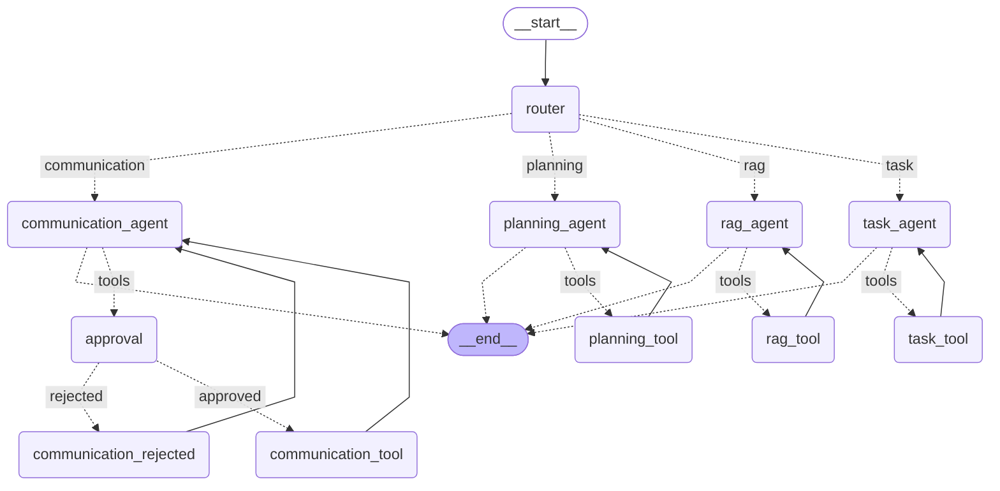

# WorkMate AI Workflow

```mermaid
---
config:
  flowchart:
    curve: linear
---
graph TD;
	__start__([<p>__start__</p>]):::first
	router(router)
	task_agent(task_agent)
	task_tool(task_tool)
	rag_agent(rag_agent)
	rag_tool(rag_tool)
	planning_agent(planning_agent)
	planning_tool(planning_tool)
	communication_agent(communication_agent)
	approval(approval)
	communication_rejected(communication_rejected)
	communication_tool(communication_tool)
	__end__([<p>__end__</p>]):::last
	__start__ --> router;
	approval -. &nbsp;rejected&nbsp; .-> communication_rejected;
	approval -. &nbsp;approved&nbsp; .-> communication_tool;
	communication_agent -.-> __end__;
	communication_agent -. &nbsp;tools&nbsp; .-> approval;
	communication_rejected --> communication_agent;
	communication_tool --> communication_agent;
	planning_agent -.-> __end__;
	planning_agent -. &nbsp;tools&nbsp; .-> planning_tool;
	planning_tool --> planning_agent;
	rag_agent -.-> __end__;
	rag_agent -. &nbsp;tools&nbsp; .-> rag_tool;
	rag_tool --> rag_agent;
	router -. &nbsp;communication&nbsp; .-> communication_agent;
	router -. &nbsp;planning&nbsp; .-> planning_agent;
	router -. &nbsp;rag&nbsp; .-> rag_agent;
	router -. &nbsp;task&nbsp; .-> task_agent;
	task_agent -.-> __end__;
	task_agent -. &nbsp;tools&nbsp; .-> task_tool;
	task_tool --> task_agent;
	classDef default fill:#f2f0ff,line-height:1.2
	classDef first fill-opacity:0
	classDef last fill:#bfb6fc

```
